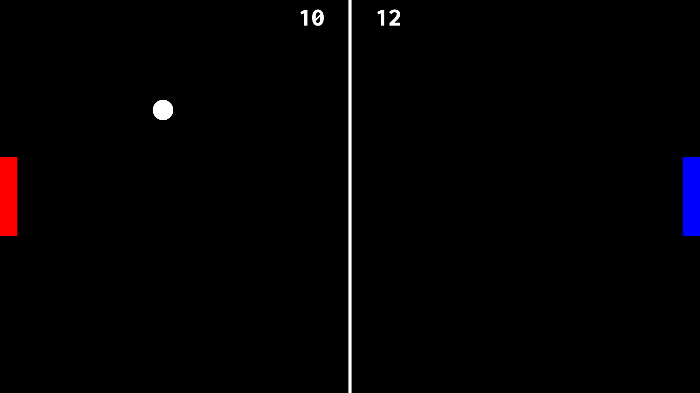

# Pong Game
A simple implementation of the classic Pong game using C++ and SFML.

## Installation
To run the game, you need to have SFML installed on your machine. If you don't already have it, you can download it from the official website at https://www.sfml-dev.org/.

After installing SFML, you can compile the game by running the following command in your terminal:

```
g++ src/main.cpp -o PongGame -lsfml-graphics -lsfml-window -lsfml-system
```

## Controls
- Player 1: W (up), S (down)
- Player 2: Up arrow (up), Down arrow (down)

## Screenshots

